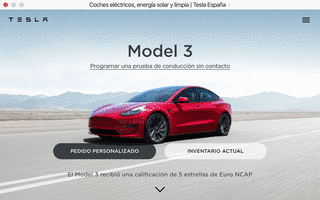

# HTML & CSS - Cloning tesla landing page

En este ejercicio vamos a clonar la landing de https://www.tesla.com/es_es
La dificultad de este ejercicio consta en colocar imagenes de fondo que dependan del tamaño del viewport. 
Para ello usaremos las unidades relativas al mismo `vh` y `vw`.

Así es como debe quedar nuestro ejemplo:

Todas las imagenes necesarias para este ejercicio estan en el directorio `images` de esta carpeta.

# CORE Code School - Bootcamps de código:

ATRÉVETE.DESAFÍATE.SUPÉRATE

Un bootcamp es un curso intensivo de programación con una duración de 12 semanas, abierto a todos los públicos y niveles. En particular a aquellos que quieran cambiar su carrera profesional o dar un boost a sus conocimientos técnicos y especializarse en el desarrollo web backend o frontend.

En CORE somos programadores con amplia experiencia en desarrollo. Nos encanta el código y nuestros bootcamps se enfocan en las tecnologías más punteras del último año. Nuestros alumnos salen preparados para aterrizar en el mundo tech. ¡Atrévete a programar!

👩🏽‍💻👨🏼‍💻

CODE. ENJOY. REPEAT - https://www.coreof.tech/
